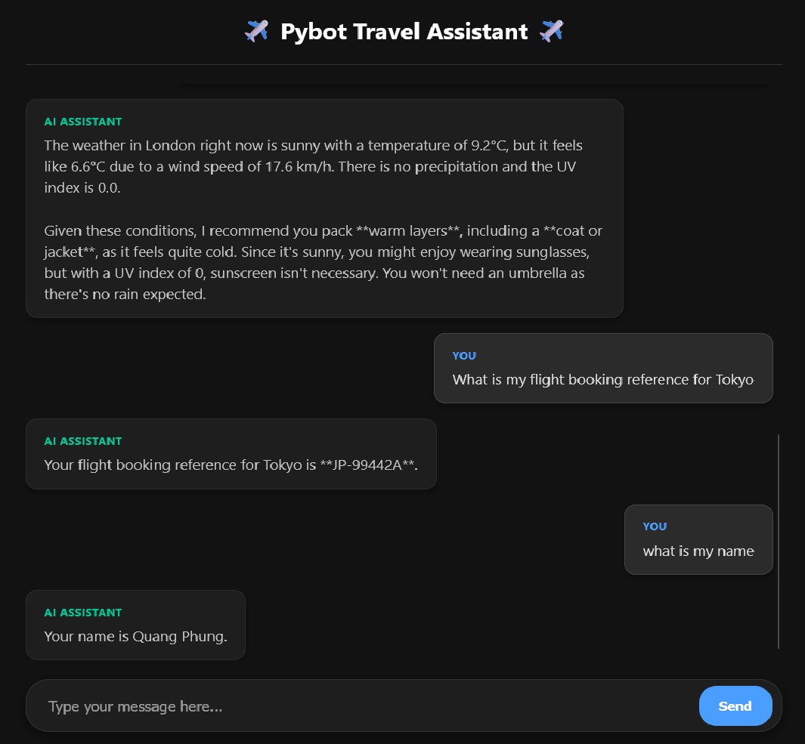

# Pybot: AI Travel & Packing Assistant

> _An intelligent AI Travel Assistant powering dynamic multi-modal data processing and interactive real-time tools._



Pybot is a full-stack, agentic AI travel assistant built as a technical interview demonstration. It leverages the Google Gemini AI to intelligently process natural language, read local user documents (PDF, TXT, MD), and dynamically trigger external APIs to provide personalized travel, budget, and packing advice.

---

## Architecture & Stack

To demonstrate production-level maturity, this project adopts a **Decoupled Architecture** rather than a monolithic script.

- **Frontend:** React (TypeScript + Vite). Provides a responsive, asynchronous chat UI with state management.
- **Backend:** Python + FastAPI. Acts as a secure middleware layer, managing the LLM connection, CORS, and Pydantic input validation to prevent malformed requests.
- **AI Engine:** Google Gemini (via the official \google-genai\ SDK), utilizing **Native Tool Calling**.

## Core Design Decisions & Assumptions

1.  **The Strategy Pattern (Agent Tooling):**
    Instead of procedural, hard-coded API scripts, the backend relies on an Object-Oriented interface (\BaseTool\ in \ ools.py\). This adheres to the **Open/Closed Principle**the system is open to infinite new tools (Booking, Weather, Currency) without ever needing to modify the core \pi.py\ engine logic.
2.  **Multi-Modal Handing vs. Vector DBs:**
    The prompt required reading static multi-modal files. Given the small scope of personal travel documents, building a full Vector Database (Chroma/Pinecone) was deemed over-engineered. Instead, Pybot uses a dynamic script to extract text/binary from \.txt\, \.md\, and \.pdf\ files on demand and injects them securely into the LLM's context window.
3.  **Local vs. External Tools:**
    - **High-Reliability External APIs:** Weather (\WeatherAPI\) and Currency (\Frankfurter App\) use live HTTP requests.
    - **Mocked Databases:** Flight and Hotel booking APIs are notoriously rate-limited and slow on free tiers. Following the project requirements, these were simulated locally via dictionaries to guarantee flawless live demos.
    - **Native Compute:** Timezone calculations use local Python libraries (\pytz\) to eliminate API latency and dependency.

---

## Key Features Capabilities

The agent decides _autonomously_ which tools to use based on the user's prompt:

- ** Document Reader:** Parses local itineraries, Visa rules, and budgets.
- ** Live Weather & Packing:** Fetches real-time weather and enforces logical clothing constraints (e.g., suggesting umbrellas if \precip_mm > 0\).
- ** Currency Converter:** Fetches live forex rates without an API key.
- ** Time Awareness:** Uses system time to overcome the standard LLM "time hallucination" flaw.
- ** Mock Booking Db:** Retrieves real-time status of flights and hotels.

---

## How to Run Locally

### Prerequisites

- **Node.js** (v18+)
- **Python** (3.10+)
- Two free API keys (Google Gemini & WeatherAPI)

### Step 1: Environment Setup

1. Clone the repository.
2. Navigate to the `backend/` folder and create a `.env` file.
3. Add your keys to the `.env` file:
   ```ini
   GOOGLE_API_KEY=your_gemini_key_here
   WEATHER_API_KEY=your_weatherapi_key_here
   ```

### Step 2: Start the Backend (Terminal 1)

Open a terminal, create your virtual environment, install dependencies, and start FastAPI.
_(Commands shown for Windows environments)_

```powershell
cd backend
python -m venv .venv
.\.venv\Scripts\Activate.ps1
pip install -r requirements.txt
python api.py
```

_The backend is now running on `http://127.0.0.1:8000`_

### Step 3: Start the Frontend (Terminal 2)

Open a **new** terminal, install Node packages, and start the Vite dev server:

```powershell
cd frontend
npm install
npm run dev
```

_Click the `http://localhost:5173` link to open the UI in your browser._

---

## Example Prompts to Test

To see the Agent's multi-step reasoning capabilities, copy and paste these exact prompts into the chat UI:

**1. Testing Cross-Referencing (Docs + Currency + Math):**

> _"Read my documents. I am currently planning out Trip 2. Check the real-time flight status and hotel for that trip. Also, I want to do the Mount Fuji day trip mentioned in my promotions file. Using the currency converter, tell me if I can afford that tour based on my allocated budget?"_

**2. Testing Weather Tool & Logic Constraints:**

> _"What is the weather like in London right now? Please tell me exactly what clothing I need to pack based on those conditions."_

**3. Testing Multi-Document Logical Synthesis:**

> _"I have a trip to Japan coming up. Look at my health profile and the Visa requirements documents. Is there anything I need to be careful about regarding my medications before I fly?"_
